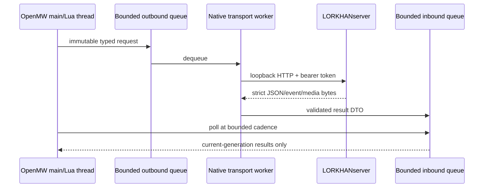

# LORKHAN architecture

## Deployment boundary

Windows runs a side-by-side LORKHAN OpenMW package and the Lua mod against user-supplied Morrowind
GOTY data. WSL2 runs Apache/PHP/PostgreSQL at `http://127.0.0.1:8089/LORKHANserver`. The management
UI is browser-only; the game uses versioned `/api/v1` endpoints. Provider calls originate only from
the server. Neither Lua nor the runtime receives provider credentials.

## Client components

| Component | Owns | Must not own |
| --- | --- | --- |
| OpenMW upstream | Game loop, objects, world, saves, rendering, audio, Lua runtime | Provider/server policy or LORKHAN profiles. |
| Native bridge | Typed transport, auth, limits, cancellation, native status, media cache/service | Prompt logic, arbitrary HTTP, model actions, gameplay policy. |
| GLOBAL Lua | Session/generation, snapshots, target/audience registry, turn/action orchestration | Input widgets, actor self-mutation, secrets. |
| PLAYER Lua | Input actions, overlay/HUD, subtitle view model, player-local state | Network implementation, arbitrary actor mutation. |
| CUSTOM actor Lua | Self AI packages, animations, speech, per-actor terminal results | Other actors, server calls, global policy. |
| Server | Persistence, prompts, connectors, memory, policy, management | OpenMW objects or assumed game-thread success. |

## Threads and queues

There is one transport worker. It owns sockets and never captures engine/Lua objects. Main-thread
polling drains at most a configured count/time budget per frame. Queue full, timeout, invalid data,
shutdown and cancellation become explicit result codes; none block the game.

## Identity model

Every envelope contains:

- protocol/schema version and client build;
- OpenMW version, Lua API revision, platform and capability set;
- installation ID, profile ID, playthrough ID, session ID and monotonically increasing generation;
- request and turn IDs as UUIDs;
- ordered content files plus a SHA-256 content fingerprint;
- actor/object identity using record ID, runtime RefNum/FormId when available, content file source,
  cell identity and a display name snapshot.

Display names are never authoritative. A stale or ambiguous identity fails closed.

## Lifecycle

1. MENU script can display native bridge/config status but sends no gameplay snapshot.
2. `onPlayerAdded` begins a session, increments generation, negotiates capabilities and emits init.
3. GLOBAL discovers active actors through engine handlers and attaches the CUSTOM action script only
   to participants as needed.
4. PLAYER input starts a turn; GLOBAL freezes target/audience/context DTOs and submits them.
5. Responses enter one ordered per-actor speech lane only if all identity/generation fields still match.
6. A rechat continuation may be submitted only after the originating turn is terminal, every queued
   utterance has reached a terminal delivery result, the final result is `played`, and the inherited
   rechat depth has not been exhausted. Rechat cannot emit game actions.
7. New player input, target loss, delivery failure, save/load, cell transition, interruption, halt,
   or generation change cancels the active rechat chain.
8. Save, load, new game, menu return, profile switch, halt or shutdown cancels transport, clears
   queues/UI/speech/temporary AI and increments generation.
9. `onSave` stores only versioned lightweight Lua state; requests, tokens, raw prompts/audio and
   engine pointers are never serialized.

## Configuration

Tracked defaults contain no secrets. User configuration lives under the OpenMW user configuration
directory in `lorkhan.toml`; native code reads it and exposes only safe derived status. Precedence:

1. compiled safe defaults;
2. tracked LORKHAN defaults;
3. user `lorkhan.toml`;
4. command-line diagnostic overrides limited to non-secret test settings.

The endpoint defaults to `http://127.0.0.1:8089/LORKHANserver/api/v1`. Only `127.0.0.0/8` and `::1`
IP literals are valid. The server setup generates the pairing token and writes an importable config
snippet with restrictive permissions. Logs print a token fingerprint only.

## Failure behavior

- Server unavailable: game and vanilla dialogue continue; overlay shows offline/retry state.
- Provider unavailable: server returns a typed provider failure; no fake character speech.
- Malformed/large response: native parser rejects it and records a redacted diagnostic.
- Stale result: silently discarded from gameplay, counted in diagnostics.
- Media failure: subtitle remains, speech reports failure, queue advances according to policy.
- Action failure: exactly one terminal result; character follow-up may acknowledge it once.
- Queue pressure: reject newest non-critical request; halt/cancel/control always has reserved capacity.
- Shutdown: cancel sockets, join worker within deadline, abandon no thread, persist no secret.

## Security boundary

The server validates token, media ownership, schema, limits, identifiers and action policy. Native
code validates endpoint, HTTP response, schema, limits, hashes and generation. Lua validates user
enablement, target, action tier and game preconditions. Redundant validation is intentional.
