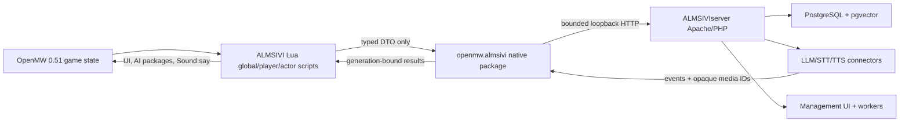

# ALMSIVI program plan

Research date: 2026-07-18

## Outcome

Build the Morrowind/OpenMW sibling to CHIM, Dialectic, and SYNTH in two independently maintainable
private repositories:

- `ALMSIVI`: a pinned, side-by-side OpenMW runtime, minimal native bridge, Lua gameplay/UI mod,
  tests, patches, source packaging, and installer.
- `ALMSIVIserver`: the final Synthserver architecture adapted to TES3/OpenMW identity, context,
  actions, setup, UI, persistence, and provider flows.

The first useful vertical slice is: launch an ALMSIVI profile, select an NPC, open the ALMSIVI
overlay, type a line, send a bounded snapshot, receive a mocked response, show a subtitle, and play
verified actor-positioned speech. Loading a save or halting invalidates the old request.

The complete target retains all engine-applicable features from the reference stack. OpenMW's age
does not justify a thin chatbot: its 0.51 Lua API already supplies actor/world reads, custom UI,
input, events, persistent state, animated speech, object identity, inventory and typed AI packages.
The one missing product boundary is network/media ingress, which the native bridge supplies.

## Evidence baselines

| System | Pin | Use |
| --- | --- | --- |
| OpenMW | `openmw-0.51.0@f4bec41444214a7903bebd178389ca22ca13f646` | Runtime, Lua API 129, build/test suite, GPL baseline. |
| SYNTH | final tested main SHA at implementation start | Latest client protocol, lifecycle, transport, action-result and evidence design. |
| Synthserver | final tested main SHA at implementation start | Direct server seed after its Fallout work is complete. |
| Dialectic | `eddbdc77a8347128b5cf5bcd68df0c2404fbf074` | Mature native client behaviors and New Vegas concepts to translate, not copy blindly. |
| DialecticServer | `f447a9c6b59bfc689c788fb0139a0d13c6c6dc51` | Server feature inventory and migration lineage. |
| CHIM | `77c73ffb6bb32c226340bbda93b3aac5a7ad49f8` | Mature Skyrim conversations, groups, context, actions, voices, and UI concepts. |
| HerikaServer | `0dbfa3eb4d3197d8159b5ff2c77bfdb5bf98b4d0` | Original server lineage and installation/data-flow vocabulary. |

Future SYNTH pins are deliberately recorded at implementation start, after its stop condition. This
is a deterministic gate, not an open design question.

## Closed decision register

| ID | Decision |
| --- | --- |
| D01 | Repositories are `RANGROO/ALMSIVI` and `RANGROO/ALMSIVIserver`, both private during development. |
| D02 | ALMSIVI begins only after SYNTH and Synthserver meet their non-game stop conditions. |
| D03 | Runtime pin is OpenMW 0.51.0 commit `f4bec...f646`, Lua API revision 129. No floating `stable`/`latest`. |
| D04 | The product is a side-by-side ALMSIVI-branded OpenMW build plus `.omwscripts`; stock OpenMW is never overwritten. |
| D05 | A pure Lua implementation is rejected because OpenMW Lua is OS-sandboxed and has no network package. |
| D06 | Native code exposes only typed ALMSIVI operations. There is no generic HTTP/socket/filesystem/shell Lua API. |
| D07 | Transport is asynchronous HTTP/1.1 over an IP loopback literal using Boost.Asio/Beast and `Boost::system`; redirects, DNS and non-loopback endpoints are rejected. |
| D08 | Authentication is a 256-bit server-generated pairing token stored only in native configuration and server secret configuration, never returned to Lua or logs. |
| D09 | Server base is the final tested Synthserver, migrated by explicit semantic mapping to TES3/OpenMW. |
| D10 | Windows x64 Release is the supported product build and CI platform. Linux x64, macOS arm64, and Android are deferred and have no continuous build requirement. |
| D11 | Vanilla dialogue remains intact. ALMSIVI uses a dedicated configurable action and passively captures `DialogueResponse` context. |
| D12 | GLOBAL Lua orchestrates; PLAYER Lua owns input/UI; dynamically attached CUSTOM actor scripts own self-only AI/animation/speech. |
| D13 | Generated speech is downloaded and hash-verified natively into an ALMSIVI cache, mounted/registered through a controlled engine media service, and invoked through opaque media IDs. Lua never supplies host paths. |
| D14 | Protocol is `almsivi.*.v1`, strict JSON envelopes plus bounded event polling. It retains SYNTH request/action-result semantics but uses TES3/OpenMW identity. |
| D15 | One game profile has one server playthrough and session. Group dialogue supports many active characters; network multiplayer is out of scope. |
| D16 | No `.omwaddon` is needed initially. Original records/content are a separately gated later deliverable. |
| D17 | Model actions are a typed allowlist with read-only and mutation tiers. No arbitrary console, Lua, MWScript, record creation, file path, or URL. |
| D18 | Modified OpenMW runtime/source distribution follows GPLv3 obligations; server licensing/provenance is audited from the final Synthserver seed before release. |
| D19 | No Bethesda data, voices, saves, or third-party assets enter Git, CI, Azure, or release packages. Users provide legal Morrowind GOTY data locally. |
| D20 | OpenMW upgrades are explicit new pins with API/patch/save/mod-list matrices. A 0.51 save may not be treated as downgrade-safe. |
| D21 | Supported compatibility profiles are minimal GOTY, I Heart Vanilla, Expanded Vanilla, Total Overhaul, Tamriel Rebuilt/Project Tamriel, controller/Steam Deck, and voice-mod coexistence. |
| D22 | Evidence, not elapsed time, ends the implementation run. In-game claims require the exact package, data/profile manifest, logs, save copy, and captured result. |

Open design questions: **none**. Unknown future facts (final SYNTH SHA, installed game-data language,
provider credentials) have deterministic intake steps and do not change architecture.

## Product principles

1. Preserve the sandbox: add one product capability, not a general escape hatch.
2. Use OpenMW-native Lua and engine abstractions before patching C++.
3. Keep engine objects on the main thread; transport moves immutable, bounded DTOs.
4. Bind every result to profile, playthrough, session, generation, request, and turn.
5. Use stable TES3 identities: content file/load order plus RecordId and runtime RefNum/FormId.
6. Keep vanilla gameplay available and ALMSIVI independently disableable.
7. Make setup local-first: Apache and the bridge listen/connect on loopback only by default.
8. Measure parity end to end. A UI label or database table alone is not a feature.
9. Preserve provenance and GPL/source obligations from the first import.
10. Never infer in-game correctness from unit tests or a build artifact.

## System flow

## Delivery workstreams and gates

### Phase 0: post-SYNTH intake and reproducible foundations

- Verify SYNTH/Synthserver completion, clean main branches, test results, licenses, and final SHAs.
- Create the source/behavior/provenance map before importing code.
- Create a pinned OpenMW upstream worktree and build an unmodified control on all CI platforms.
- Establish patch-series tooling, schemas, identical fixtures, fake server, and evidence ledger.

Gate: source pins and licenses are recorded; upstream control builds; schemas validate in both
repositories; no reference repo is modified.

### Phase 1: bridge and health slice

- Add native configuration, token handling, URL enforcement, worker lifecycle, bounded queues,
  cancellation, generation, status/capability DTOs, and strict response parsing.
- Register `openmw.almsivi` only in intended script contexts.
- Complete init/health round trip with a visible Lua status surface.

Gate: control and patched OpenMW tests pass; fake-server positive and abuse cases pass; a static API
audit proves no generic network/path primitive is exported.

### Phase 2: conversation, UI, input, and speech

- Add dedicated target/audience selection, custom HUD/overlay, keyboard/controller bindings, text,
  push-to-talk, STT, subtitles, response queue, TTS, interrupt/halt, and actor speech.
- Attach CUSTOM scripts only to active participating actors; detach/expire safely.
- Preserve vanilla activation and dialogue UI.

Gate: no-game tests prove queues/generations/media; Windows minimal profile proves target -> text ->
response -> subtitle/speech and interruption across menu/save/cell transitions.

### Phase 3: context, memory, and character systems

- Add bounded context collectors and explicit unavailable fields rather than fabricated values.
- Implement server events, profiles, relationships, memories, world knowledge, narrator, diary,
  rechat, boredom, greetings, summaries, playthrough export/restore, and prompt traceability.
- Ensure load order and mod-added records retain stable provenance.

Gate: fixtures cover vanilla and modded identities; context budgets and frame cost pass; server UI
shows the persisted source event and its derived memory/profile state.

### Phase 4: typed actions and terminal results

- Prove inspect -> result first; then implement movement/AI, inventory/use, combat and safe UI actions.
- Validate authority, actor/target, preconditions, active generation, tier, parameters and limits in
  Lua; validate schema and policy again on the server.
- Emit exactly one terminal result (`succeeded`, `failed`, `rejected`, `timed_out`, `cancelled`) and
  allow result-aware follow-up without infinite loops.

Gate: allowlist and negative tests pass; each enabled action has an exact in-game acceptance row.

### Phase 5: operations, compatibility, and release hardening

- Finish management UI, provider setup, health, logs, diagnostics, backups, migrations and workers.
- Run all mod-list profiles, save upgrade/copy/rollback, provider failure, long-session soak, and
  package reproducibility audits.
- Produce runtime, Lua-mod-only, debug-symbol, corresponding-source, notices/SBOM and checksum
  artifacts. Never bundle game data.

Gate: every non-deferred completion row has evidence; a clean install and uninstall leave stock
OpenMW/profile/data untouched.

### Phase 6: optional original content addon

Execute `CONTENT-ADDON-DEFERRED.md` only when a required feature is proven impossible through the
engine/Lua API and original records materially improve it. Core dialogue must remain functional
without the addon.

## Completion states

- `PLANNED`: design and proof specified, no implementation claim.
- `AUTOMATED`: implementation plus repeatable no-game test evidence.
- `WINDOWS BUILD PROVEN`: clean exact-pin Windows build/package evidence.
- `IN-GAME PROVEN`: exact package/profile passed its Windows Morrowind matrix.
- `COMPATIBILITY PROVEN`: exact package passed a named mod-list profile.
- `DEFERRED`: deliberately outside this run with entry criteria and acceptance matrix.

The Azure run is complete only when every non-game/non-Android/non-addon row is at least AUTOMATED,
all target builds/packages pass, and no unexplained gap remains. Product release readiness additionally
requires minimal-profile in-game proof. Compatibility claims require their own profile evidence.

## Risks and controls

| Risk | Control |
| --- | --- |
| Engine patch drifts from OpenMW | Exact tag pin, small isolated files, patch manifest, upstream control, periodic rebase rehearsal. |
| Lua sandbox accidentally weakened | Typed package only, context restrictions, API symbol audit, negative security tests. |
| Network stalls the game | One bounded worker, immutable DTOs, no blocking Lua/main-thread call, deadlines/backpressure. |
| Generated audio is unsafe/unbounded | Opaque ID, size/hash/MIME/codec limits, cache quota, no redirects, verified decode. |
| Modded identities collide | Content fingerprint, ordered content list, RecordId + RefNum/FormId + cell, explicit ambiguity errors. |
| Save corruption/downgrade | Copy saves before tests/upgrades, versioned onSave data, stale generation invalidation, never promise downgrade. |
| Server migration retains Fallout language | Semantic audit and forbidden-term test over schema/UI/routes/fixtures. |
| GPL or asset violation | Provenance ledger, source archive, notices/SBOM, proprietary-data scan, release checklist. |
| Large mod lists hurt frames/context | No full-world scan; bounded active cell/nearby budgets, incremental snapshots, performance profile gates. |
| Model performs unsafe mutation | Two-sided typed allowlist, default read-only tier, user-visible enablement, exact terminal results, halt. |

## Primary research sources

- OpenMW 0.51.0 release and save warning: <https://openmw.org/2026/openmw-0-51-0-released/>
- OpenMW 0.51.0 source tag: <https://gitlab.com/OpenMW/openmw/-/tree/openmw-0.51.0>
- Lua sandbox and script contexts: <https://openmw.readthedocs.io/en/openmw-0.51.0/reference/lua-scripting/overview.html>
- Lua package index: <https://openmw.readthedocs.io/en/openmw-0.51.0/reference/lua-scripting/index_packages.html>
- Engine handlers: <https://openmw.readthedocs.io/en/openmw-0.51.0/reference/lua-scripting/engine_handlers.html>
- Core/world/types/events/AI APIs: <https://openmw.readthedocs.io/en/openmw-0.51.0/reference/lua-scripting/index.html>
- Current OpenMW mod-list compatibility baselines: <https://modding-openmw.com/lists/>
