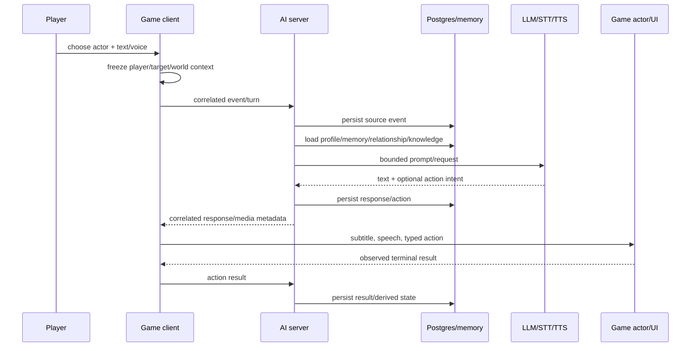
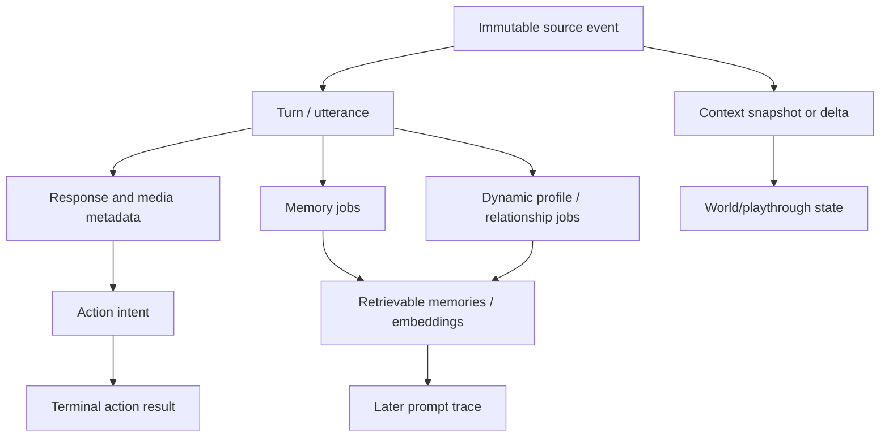

# Reference stack and LORKHAN data flow

This is implementation context for how CHIM, HerikaServer, Dialectic, DialecticServer, SYNTH and
OpenMW divide work. It defines behaviors and authority boundaries to preserve; it is not permission
to copy incompatible code, assets, ABI assumptions or legacy transport.

## Pinned reference systems

| Product | Pin at planning time | Role |
| --- | --- | --- |
| CHIM | `Dwemer-Dynamics/CHIM@77c73ffb6bb32c226340bbda93b3aac5a7ad49f8` | Skyrim client behavior/design vocabulary. |
| HerikaServer | `abeiro/HerikaServer@0dbfa3eb4d3197d8159b5ff2c77bfdb5bf98b4d0` | Original PHP/Postgres AI server lineage. |
| Dialectic | `Dwemer-Dynamics/Dialectic@eddbdc77a8347128b5cf5bcd68df0c2404fbf074` | Native Fallout NV client and server boundary. |
| DialecticServer | `Dwemer-Dynamics/DialecticServer@f447a9c6b59bfc689c788fb0139a0d13c6c6dc51` | Modernized server feature baseline. |
| SYNTH/Synthserver | final completed main SHAs captured later | Direct predecessor for transport/server evidence design. |
| OpenMW | `openmw-0.51.0@f4bec41444214a7903bebd178389ca22ca13f646` | Target engine, Lua API revision 129 and GPL source. |

## Reference deployment topology

CHIM/Dialectic-style systems have two physical sides:

- **Game side on Windows:** extender/native plugin and sometimes Papyrus/content packages collect
  engine state, player input, actor identity and execute engine actions. It presents subtitles/audio.
- **Server side, commonly WSL/Apache/PHP/PostgreSQL:** accepts events, persists them, constructs
  character/world context and prompts, calls LLM/STT/TTS providers, manages memories/profiles/actions,
  serves media and exposes a browser management UI. Workers perform slower derived tasks.

LORKHAN keeps this separation. OpenMW replaces Bethesda executable/extender/Papyrus integration;
LORKHANserver replaces game-specific Fallout/Skyrim semantics while preserving mature server product
outcomes. Provider keys and database access never cross into the game runtime.

## Reference setup sequence

1. Install the legally owned game and required game-side runtime/mod.
2. Install/configure the local PHP/Postgres server in WSL, including schema and provider credentials.
3. Create a character/playthrough/profile and enable desired actions/features in the management UI.
4. Configure the game client to reach only the local server and establish an install/session identity.
5. Start game: client emits init/capabilities and initial world/character state.
6. Server binds the session to a playthrough and returns current safe configuration.

LORKHAN adapts this to a side-by-side OpenMW package, `LORKHAN.omwscripts`, a server-generated pairing
token and a separate OpenMW config profile. There is no F4SE/NVSE/SKSE loader, Papyrus polling bridge,
ESP requirement, or credential in Lua.

## Reference player-turn flow

Important invariants are source-event-first persistence, explicit actor/audience identity, bounded
context, correlated response, game-side authority over actual engine action, and a terminal result
return. LORKHAN preserves them with strict v1 JSON and generations rather than legacy tuples/files.

## Client initialization and context maintenance

Mature clients do more than send a sentence. They identify runtime/version, player/playthrough,
current location/time, nearby/active actors, target, equipment/state, quests, loaded mods and feature
capabilities. They update this on lifecycle and meaningful world changes rather than trusting the
server to infer the current game.

LORKHAN mapping:

- OpenMW engine handlers begin/rebind sessions on player add/load/new game and discover active actors.
- GLOBAL Lua owns a stable registry and takes full/delta snapshots under strict budgets.
- Ordered `core.contentFiles.list` plus runtime/source identity forms a content fingerprint.
- TES3 RecordId, OpenMW runtime reference, content source and cell replace Fallout FormID/Skyrim
  handles. Names remain display-only.
- Save/menu/profile transitions increment generation and cancel stale work.
- Server persists source events and acknowledges what it accepted; client never assumes persistence.

## Prompt and intelligence ownership

Reference servers typically combine:

- character base/dynamic profiles and prompt templates;
- recent transcript/events and middle/long-term memories;
- relationship state, world knowledge and playthrough summary;
- current game context and active action-result state;
- provider/model configuration and safety/size limits.

LORKHANserver retains those systems and translates the domain to Morrowind/TES3/OpenMW. The client
never assembles provider prompts, stores provider keys or decides a model's authority. The server does
not invent engine success: it requests a typed action and waits for LORKHAN's observed result.

## Response, speech, and action return

Reference clients stream or poll response text, assign a speaker, display subtitles, obtain TTS and
play it on the correct actor. They may execute a structured action and send its outcome back so the
character can react.

LORKHAN mapping:

- Server exposes ordered long-poll events; native code validates them and Lua renders deltas.
- Final utterance has explicit speaker/addressee/audience. Missing/stale actors cause delivery failure.
- TTS is a fixed authenticated media route by opaque ID/hash; native cache verifies and supplies the
  engine voice path. Actor CUSTOM script calls controlled speech so spatial/lip behavior is native.
- Action intent is schema/tier/expiry/actor/target/parameters, never code.
- Lua verifies current state, actor script executes self-safe APIs on the game thread, and exactly one
  typed terminal result returns through server persistence.
- Halt has reserved capacity and cancels transport, speech, queued actions and LORKHAN-owned AI.

## Persistent server data flow

Derived memories/summaries never overwrite immutable source events. Workers use idempotent jobs,
bounded retries and dead-letter visibility. Backups include schema/version and restore drills. Provider
raw data and secrets are minimized/redacted under retention policy.

## Management UI flow

The browser UI is not the in-game UI. It owns installation/health, provider configuration, profiles,
prompts/actions, event/request traces, memory, relationships, world knowledge, playthrough management,
worker/backups and diagnostics. It must show capability/runtime/content mismatches clearly and allow
action tiers to be disabled. It must not claim an action happened until the terminal game result.

The Lua UI is intentionally smaller: connection/profile state, target/audience, transcript/subtitles,
input/microphone, interruption/halt, current action consent/status and a link/instruction for server
management.

## Content packages are separate

CHIM/Herika ecosystems may include plugins/quests/spells/scripts/assets that are distinct from the
native client and server. Dialectic similarly has game-content companions. Those packages illustrate
why records and redistributed assets need separate provenance, load-order, save and acceptance gates.

LORKHAN needs no content records for its first product because `.omwscripts` and the engine API cover
core behavior. `CONTENT-ADDON-DEFERRED.md` defines the later original-content gate. Never import a
Skyrim/Fallout content package or Bethesda asset into LORKHAN.

## Component disposition

| Reference capability/component | LORKHAN owner | Disposition |
| --- | --- | --- |
| Game extender/native lifecycle | OpenMW + bridge | Redesign for native OpenMW lifecycle and generations. |
| Papyrus/temporary-file polling | None | Exclude; typed native bridge replaces it. |
| Client HTTP/stream/media | Native bridge | Preserve outcome, redesign as loopback Beast + long polling + opaque media. |
| Target/group/input/subtitles | PLAYER/GLOBAL Lua | Preserve outcome through OpenMW APIs. |
| Actor animation/voice/AI | CUSTOM actor Lua + engine | Preserve using self/event APIs and voice path. |
| Game context collectors | GLOBAL Lua | Semantic TES3/OpenMW rewrite. |
| FNV/Skyrim IDs/offsets/ABI | None | Exclude. Use RecordId/RefNum/content/cell identity. |
| Event/prompt/provider pipeline | LORKHANserver | Import final Synthserver architecture, translate semantics. |
| Profiles/memory/relationship/knowledge | LORKHANserver | Preserve and migrate. |
| Narrator/diary/playback-gated rechat | Both | Preserve manual narrative behavior and action-free continuation with current-game safety in Lua. |
| Boredom/greetings/combat barks/Background Life/ITT | None | Exclude; no scheduler, capability, worker, or model trigger. |
| Model actions | Server policy + Lua execution | Preserve typed intent/result; new allowlist. |
| Management UI/workers/backups | LORKHANserver | Preserve and rebrand/translate. |
| ESP/ESM content | Deferred addon | Exclude from core; original records only after gate. |

## Required end-to-end LORKHAN flows

### Bootstrap and pairing

Server setup creates database/config, generates token and prints/writes a redacted client config
snippet. User imports it to LORKHAN's OpenMW profile. Native bridge validates loopback, sends health
and session init; server returns schema/capabilities/profile binding. Lua displays ready/offline/
mismatch without learning the token.

### Player dialogue

Dedicated input -> resolved actor/audience -> frozen bounded snapshot -> typed turn -> immutable event
and prompt trace -> provider/mock -> ordered deltas/final -> subtitle -> verified TTS -> actor voice ->
delivery completion. Every step carries current IDs/generation and has observable failure.

### Voice input

Semantic PTT -> visible recording state -> bounded audio -> authenticated STT -> transcript event ->
optional player confirmation by profile -> normal dialogue flow. Open mic is separately opt-in and
rate/VAD limited. Raw audio retention defaults off.

### Action and result

Provider emits typed intent -> server schema/policy -> client schema/generation/user tier/preconditions
-> actor self execution -> observed terminal result -> server source event -> optional single result-
aware follow-up. Timeout/cancel/halt returns terminal state, not silence.

### Save/load/interruption

Lifecycle increments generation -> cancel native requests and server session generation -> stop speech
and clear temporary actor state/UI -> save versioned primitives -> load/migrate/re-resolve -> start new
session. Old events/media/actions cannot attach to the new save.

### Worker-derived memory

Persisted source turn queues idempotent memory/profile/relationship jobs -> worker derives bounded
records with source IDs/model/revision -> management UI exposes trace/edit/delete -> later prompt
retrieval records selected source IDs. Failure/retry/dead-letter never removes source events.

## Implementation checkpoints

1. Component/provenance map accepted.
2. Unmodified OpenMW control builds.
3. Strict health slice proves bridge boundary and abuse cases.
4. Targeted text flow proves all ownership boundaries with mock response.
5. Media flow proves verified actor speech.
6. Context domains and server intelligence become visible end to end.
7. One read-only action proves intent/result before more actions.
8. Management/worker/backup flows pass.
9. Packages and GPL/source/proprietary scans pass.
10. Minimal and compatibility in-game matrices pass separately.

## Source navigation for implementers

At the pinned OpenMW tag, begin with:

- `apps/openmw/mwlua/luabindings.cpp` and `luamanagerimp.cpp` for package/context registration;
- `components/lua/` for sandbox/script containers/storage/async behavior;
- `apps/openmw/mwlua/*bindings.cpp` for world/types/UI/input/sound patterns;
- `apps/openmw/mwsound/soundmanagerimp.cpp` for `Sound.say`, VFS/FFmpeg voice and loudness;
- `apps/openmw/CMakeLists.txt`, root `CMakeLists.txt`, `CI/before_script.msvc.sh` and `.gitlab-ci.yml`
  for target/dependencies/MSVC 2022 patterns;
- `docs/source/reference/lua-scripting/` for API revision 129 contracts;
- sibling LORKHANserver reference/migration documents for server paths and tests.

Inspect the final SYNTH repositories only after their start gate, then pin exact paths/SHAs in the
evidence map. Do not retain Fallout names as aliases merely to make an import compile.
